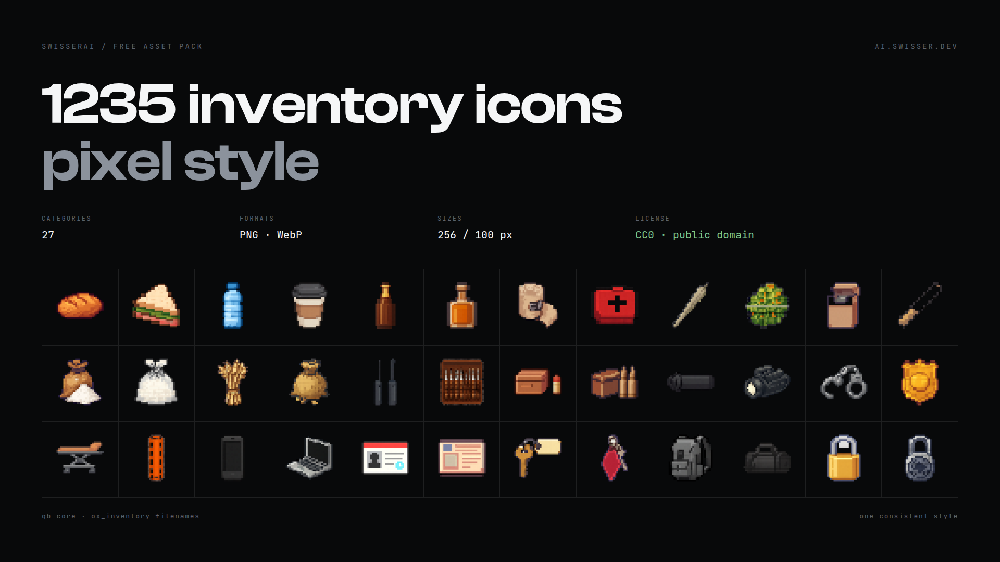

# FiveM Inventory Icons — Pixel Art

1235 inventory item icons for FiveM in one consistent pixel art style,
on transparent backgrounds, across 27 categories. CC0, so use them for
anything including paid servers, no credit needed.

Filenames follow the qb-core `shared/items.lua` naming, so most items match an existing entry without renaming.

## Download

| | | |
| --- | --- | --- |
| **Everything** | 1235 icons | [`fivem-icons-pixel-v1.0.zip`](https://github.com/SwisserDev/fivem-icons-pixel/releases/download/v1.0/fivem-icons-pixel-v1.0.zip) |

Or take single files straight out of [`png-256/`](png-256). No archive, no account.

## Install

**qb-inventory**

```bash
cp -r png-256/*/*.png resources/[qb]/qb-inventory/html/images/
```

**ox_inventory**

```bash
cp -r png-256/*/*.png resources/[ox]/ox_inventory/web/images/
```

Icons are grouped into category folders, so copy through the wildcard rather
than the folders themselves. For a custom item, point its `image` field at the
matching filename.

## Formats

| Folder | Size | Use |
| --- | --- | --- |
| [`png-256/`](png-256) | 256×256 PNG | The main set, transparent. What most inventories want. |
| [`webp-256/`](webp-256) | 256×256 WebP | Same icons, roughly 70% smaller. |
| [`webp-100/`](webp-100) | 100×100 WebP | Game-native size, smallest download for players. |

`items.json` lists every icon with its category and label.

## What's in it

<details>
<summary><b>Food</b> (100 icons)</summary>

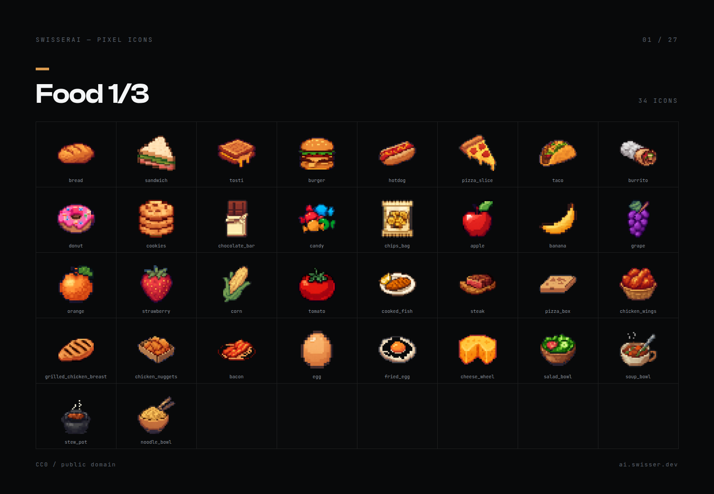

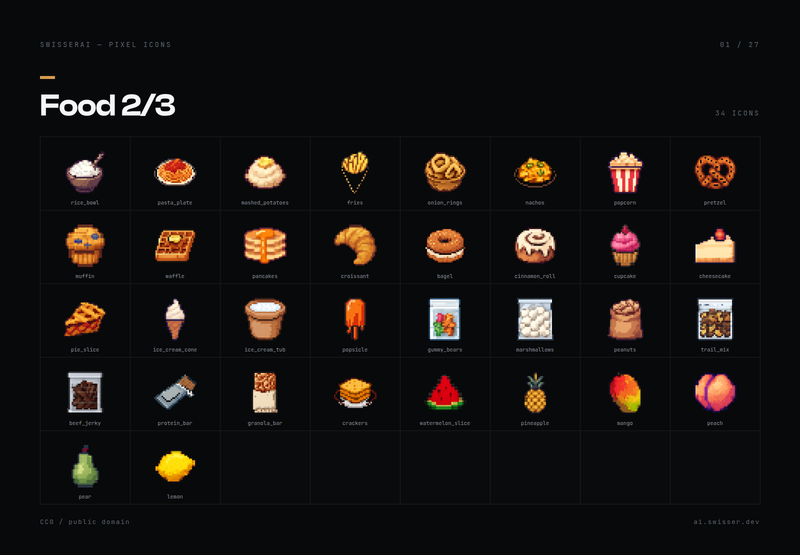

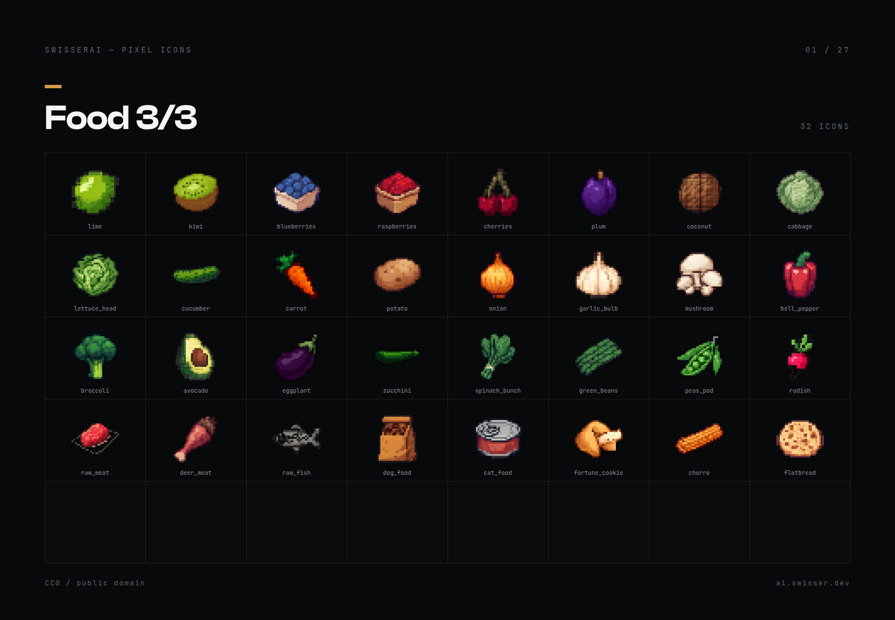

`bread` · `sandwich` · `tosti` · `burger` · `hotdog` · `pizza_slice` · `taco` · `burrito` · `donut` · `cookies` · `chocolate_bar` · `candy` · `chips_bag` · `apple` · `banana` · `grape` · `orange` · `strawberry` · `corn` · `tomato` · `cooked_fish` · `steak` · `pizza_box` · `chicken_wings` · `grilled_chicken_breast` · `chicken_nuggets` · `bacon` · `egg` · `fried_egg` · `cheese_wheel` · `salad_bowl` · `soup_bowl` · `stew_pot` · `noodle_bowl` · `rice_bowl` · `pasta_plate` · `mashed_potatoes` · `fries` · `onion_rings` · `nachos` · `popcorn` · `pretzel` · `muffin` · `waffle` · `pancakes` · `croissant` · `bagel` · `cinnamon_roll` · `cupcake` · `cheesecake` · `pie_slice` · `ice_cream_cone` · `ice_cream_tub` · `popsicle` · `gummy_bears` · `marshmallows` · `peanuts` · `trail_mix` · `beef_jerky` · `protein_bar` · `granola_bar` · `crackers` · `watermelon_slice` · `pineapple` · `mango` · `peach` · `pear` · `lemon` · `lime` · `kiwi` · `blueberries` · `raspberries` · `cherries` · `plum` · `coconut` · `cabbage` · `lettuce_head` · `cucumber` · `carrot` · `potato` · `onion` · `garlic_bulb` · `mushroom` · `bell_pepper` · `broccoli` · `avocado` · `eggplant` · `zucchini` · `spinach_bunch` · `green_beans` · `peas_pod` · `radish` · `raw_meat` · `deer_meat` · `raw_fish` · `dog_food` · `cat_food` · `fortune_cookie` · `churro` · `flatbread`

</details>

<details>
<summary><b>Drink</b> (50 icons)</summary>

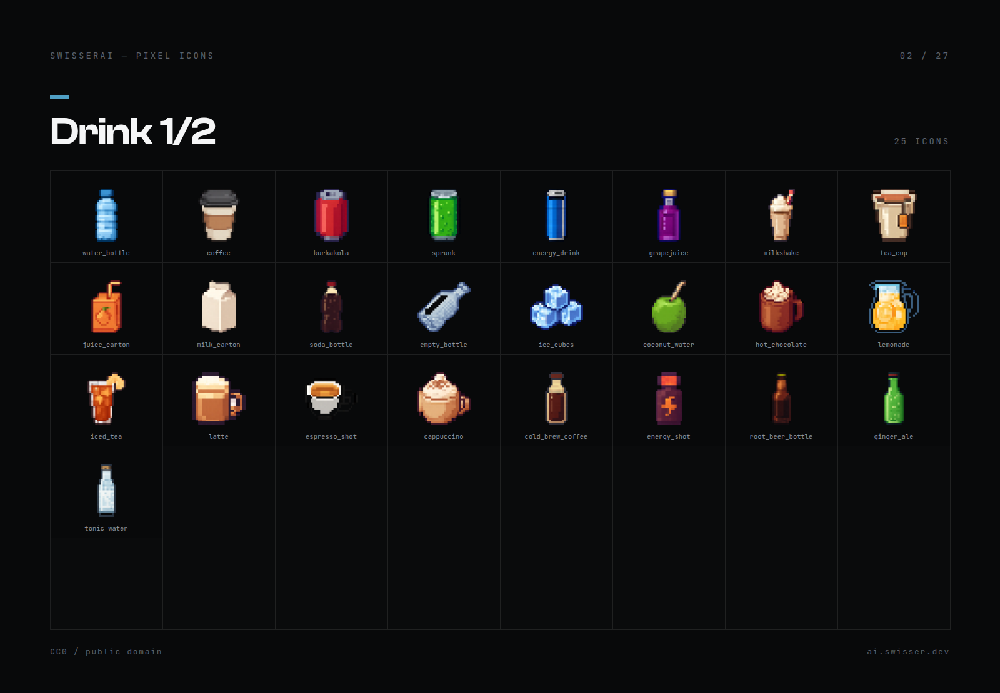

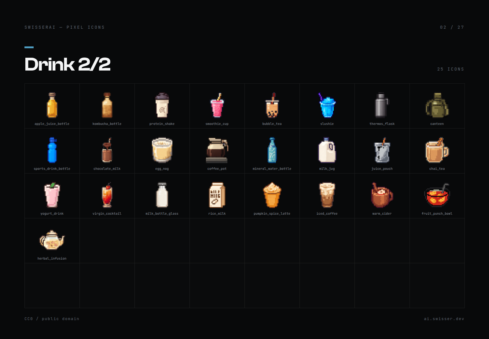

`water_bottle` · `coffee` · `kurkakola` · `sprunk` · `energy_drink` · `grapejuice` · `milkshake` · `tea_cup` · `juice_carton` · `milk_carton` · `soda_bottle` · `empty_bottle` · `ice_cubes` · `coconut_water` · `hot_chocolate` · `lemonade` · `iced_tea` · `latte` · `espresso_shot` · `cappuccino` · `cold_brew_coffee` · `energy_shot` · `root_beer_bottle` · `ginger_ale` · `tonic_water` · `apple_juice_bottle` · `kombucha_bottle` · `protein_shake` · `smoothie_cup` · `bubble_tea` · `slushie` · `thermos_flask` · `canteen` · `sports_drink_bottle` · `chocolate_milk` · `egg_nog` · `coffee_pot` · `mineral_water_bottle` · `milk_jug` · `juice_pouch` · `chai_tea` · `yogurt_drink` · `virgin_cocktail` · `milk_bottle_glass` · `rice_milk` · `pumpkin_spice_latte` · `iced_coffee` · `warm_cider` · `fruit_punch_bowl` · `herbal_infusion`

</details>

<details>
<summary><b>Alcohol</b> (38 icons)</summary>

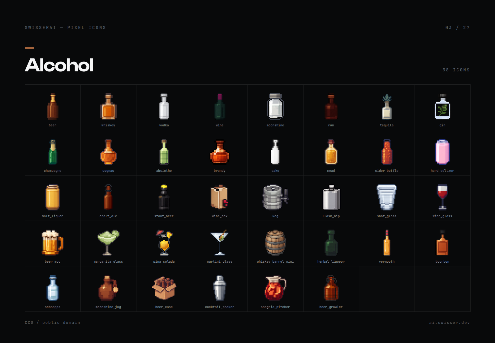

`beer` · `whiskey` · `vodka` · `wine` · `moonshine` · `rum` · `tequila` · `gin` · `champagne` · `cognac` · `absinthe` · `brandy` · `sake` · `mead` · `cider_bottle` · `hard_seltzer` · `malt_liquor` · `craft_ale` · `stout_beer` · `wine_box` · `keg` · `flask_hip` · `shot_glass` · `wine_glass` · `beer_mug` · `margarita_glass` · `pina_colada` · `martini_glass` · `whiskey_barrel_mini` · `herbal_liqueur` · `vermouth` · `bourbon` · `schnapps` · `moonshine_jug` · `beer_case` · `cocktail_shaker` · `sangria_pitcher` · `beer_growler`

</details>

<details>
<summary><b>Medical</b> (54 icons)</summary>

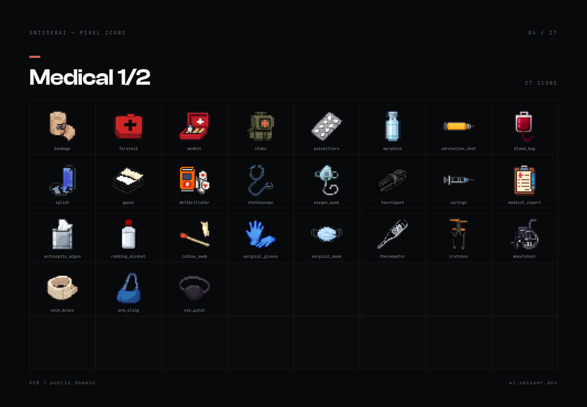

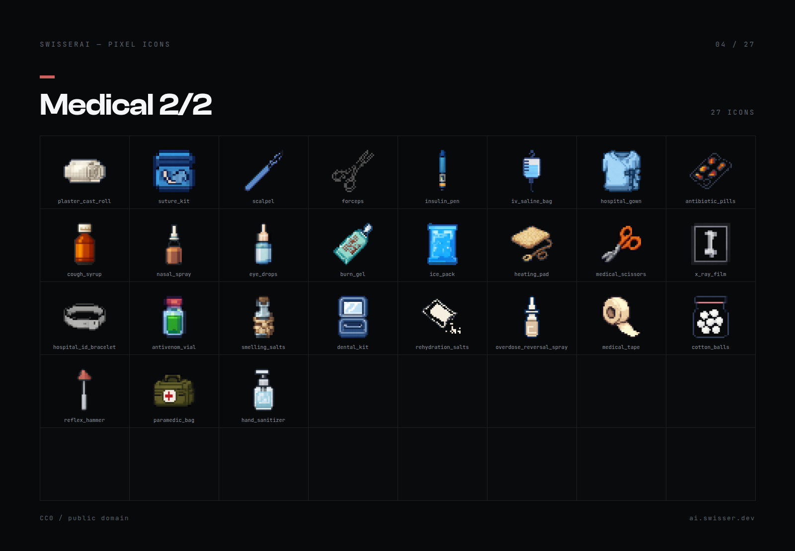

`bandage` · `firstaid` · `medkit` · `ifaks` · `painkillers` · `morphine` · `adrenaline_shot` · `blood_bag` · `splint` · `gauze` · `defibrillator` · `stethoscope` · `oxygen_mask` · `tourniquet` · `syringe` · `medical_report` · `antiseptic_wipes` · `rubbing_alcohol` · `iodine_swab` · `surgical_gloves` · `surgical_mask` · `thermometer` · `crutches` · `wheelchair` · `neck_brace` · `arm_sling` · `eye_patch` · `plaster_cast_roll` · `suture_kit` · `scalpel` · `forceps` · `insulin_pen` · `iv_saline_bag` · `hospital_gown` · `antibiotic_pills` · `cough_syrup` · `nasal_spray` · `eye_drops` · `burn_gel` · `ice_pack` · `heating_pad` · `medical_scissors` · `x_ray_film` · `hospital_id_bracelet` · `antivenom_vial` · `smelling_salts` · `dental_kit` · `rehydration_salts` · `overdose_reversal_spray` · `medical_tape` · `cotton_balls` · `reflex_hammer` · `paramedic_bag` · `hand_sanitizer`

</details>

<details>
<summary><b>Drugs</b> (53 icons)</summary>

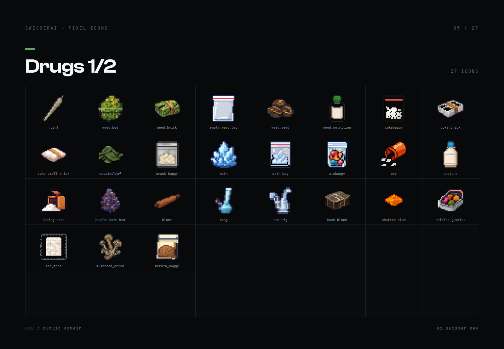

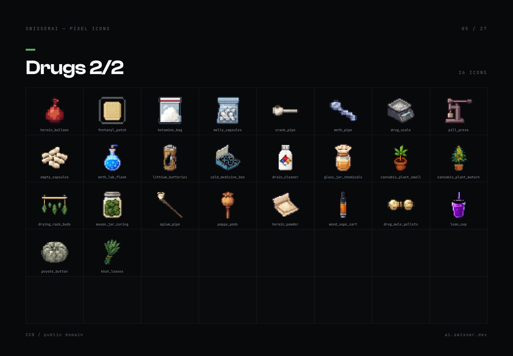

`joint` · `weed_bud` · `weed_brick` · `empty_weed_bag` · `weed_seed` · `weed_nutrition` · `cokebaggy` · `coke_brick` · `coke_small_brick` · `cocaineleaf` · `crack_baggy` · `meth` · `meth_bag` · `xtcbaggy` · `oxy` · `acetone` · `baking_soda` · `purple_haze_bud` · `blunt` · `bong` · `dab_rig` · `hash_block` · `shatter_slab` · `edibles_gummies` · `lsd_tabs` · `mushroom_dried` · `heroin_baggy` · `heroin_balloon` · `fentanyl_patch` · `ketamine_bag` · `molly_capsules` · `crack_pipe` · `meth_pipe` · `drug_scale` · `pill_press` · `empty_capsules` · `meth_lab_flask` · `lithium_batteries` · `cold_medicine_box` · `drain_cleaner` · `glass_jar_chemicals` · `cannabis_plant_small` · `cannabis_plant_mature` · `drying_rack_buds` · `mason_jar_curing` · `opium_pipe` · `poppy_pods` · `heroin_powder` · `weed_vape_cart` · `drug_mule_pellets` · `lean_cup` · `peyote_button` · `khat_leaves`

</details>

<details>
<summary><b>Smoking</b> (22 icons)</summary>

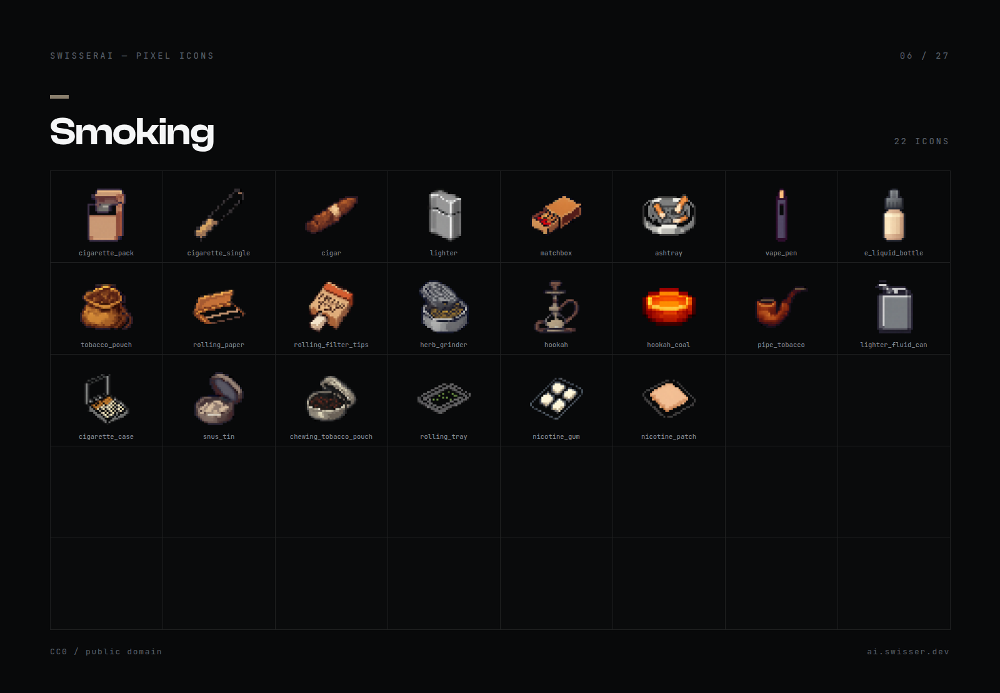

`cigarette_pack` · `cigarette_single` · `cigar` · `lighter` · `matchbox` · `ashtray` · `vape_pen` · `e_liquid_bottle` · `tobacco_pouch` · `rolling_paper` · `rolling_filter_tips` · `herb_grinder` · `hookah` · `hookah_coal` · `pipe_tobacco` · `lighter_fluid_can` · `cigarette_case` · `snus_tin` · `chewing_tobacco_pouch` · `rolling_tray` · `nicotine_gum` · `nicotine_patch`

</details>

<details>
<summary><b>Cooking Ingredients</b> (45 icons)</summary>

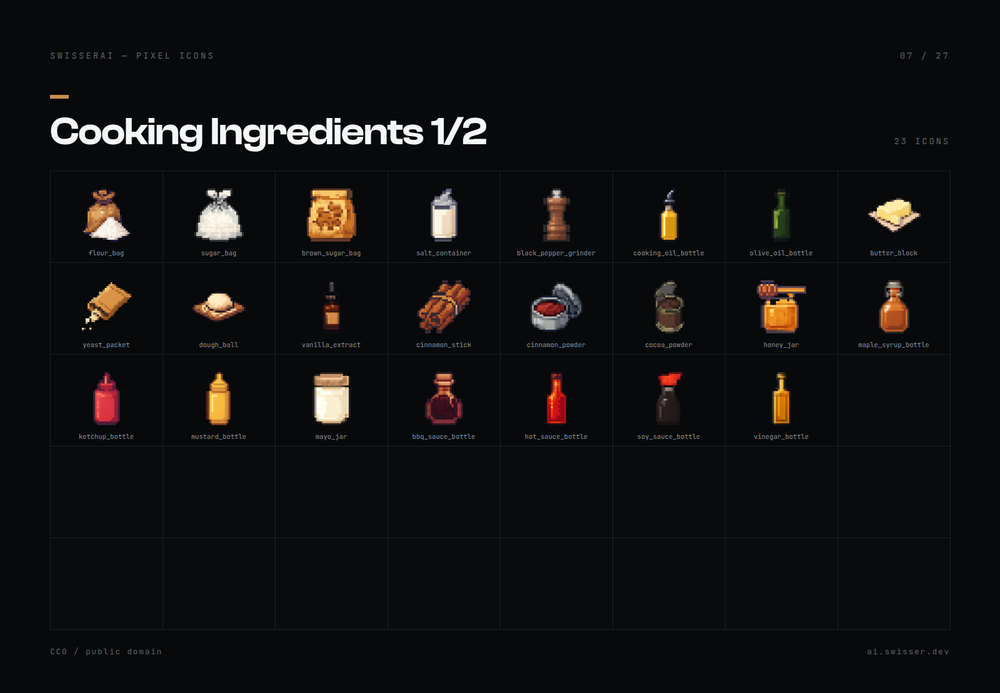

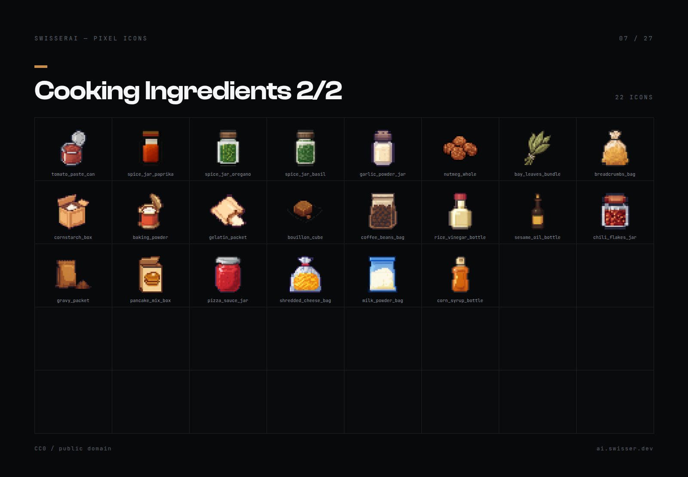

`flour_bag` · `sugar_bag` · `brown_sugar_bag` · `salt_container` · `black_pepper_grinder` · `cooking_oil_bottle` · `olive_oil_bottle` · `butter_block` · `yeast_packet` · `dough_ball` · `vanilla_extract` · `cinnamon_stick` · `cinnamon_powder` · `cocoa_powder` · `honey_jar` · `maple_syrup_bottle` · `ketchup_bottle` · `mustard_bottle` · `mayo_jar` · `bbq_sauce_bottle` · `hot_sauce_bottle` · `soy_sauce_bottle` · `vinegar_bottle` · `tomato_paste_can` · `spice_jar_paprika` · `spice_jar_oregano` · `spice_jar_basil` · `garlic_powder_jar` · `nutmeg_whole` · `bay_leaves_bundle` · `breadcrumbs_bag` · `cornstarch_box` · `baking_powder` · `gelatin_packet` · `bouillon_cube` · `coffee_beans_bag` · `rice_vinegar_bottle` · `sesame_oil_bottle` · `chili_flakes_jar` · `gravy_packet` · `pancake_mix_box` · `pizza_sauce_jar` · `shredded_cheese_bag` · `milk_powder_bag` · `corn_syrup_bottle`

</details>

<details>
<summary><b>Farming Produce</b> (34 icons)</summary>

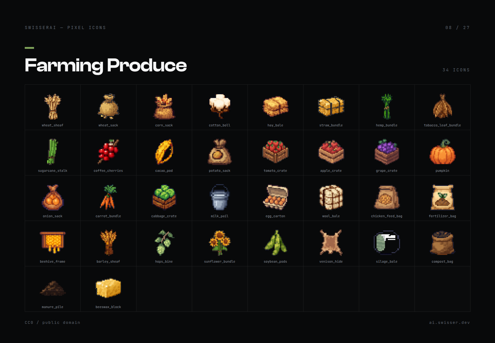

`wheat_sheaf` · `wheat_sack` · `corn_sack` · `cotton_boll` · `hay_bale` · `straw_bundle` · `hemp_bundle` · `tobacco_leaf_bundle` · `sugarcane_stalk` · `coffee_cherries` · `cacao_pod` · `potato_sack` · `tomato_crate` · `apple_crate` · `grape_crate` · `pumpkin` · `onion_sack` · `carrot_bundle` · `cabbage_crate` · `milk_pail` · `egg_carton` · `wool_bale` · `chicken_feed_bag` · `fertilizer_bag` · `beehive_frame` · `barley_sheaf` · `hops_bine` · `sunflower_bundle` · `soybean_pods` · `venison_hide` · `silage_bale` · `compost_bag` · `manure_pile` · `beeswax_block`

</details>

<details>
<summary><b>Tools</b> (68 icons)</summary>

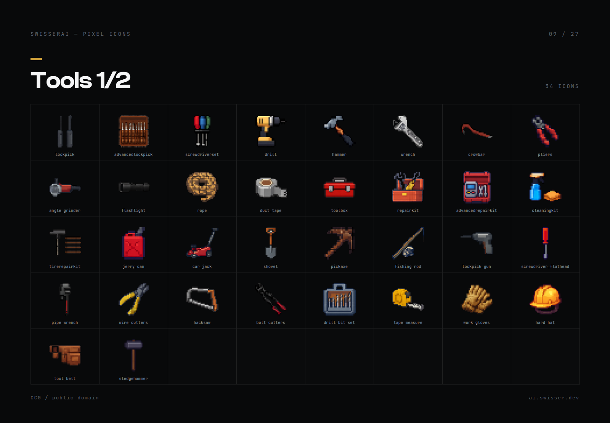

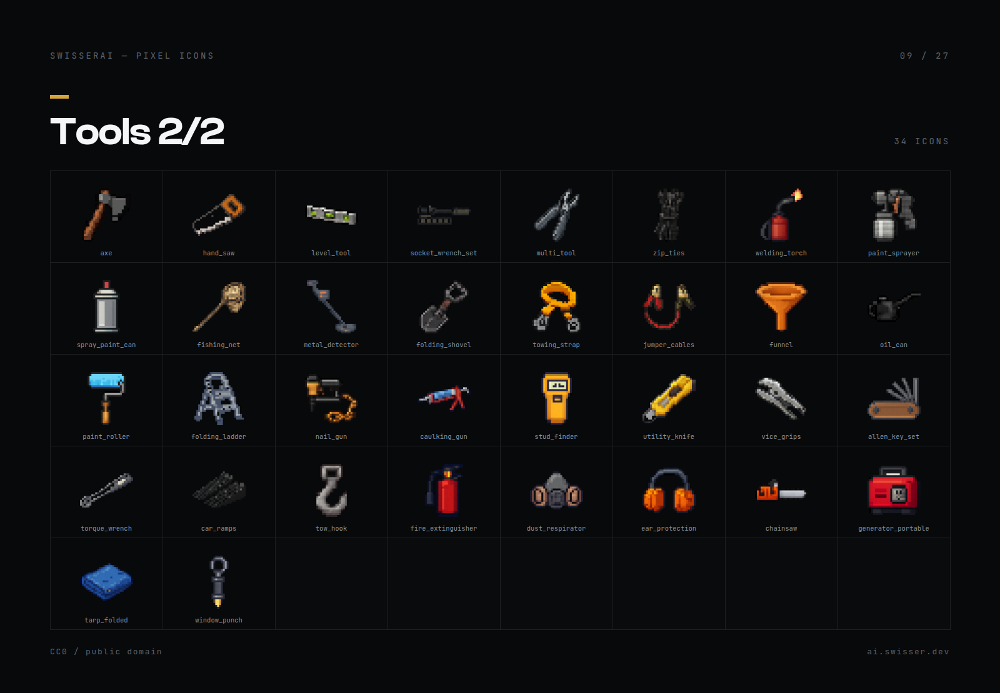

`lockpick` · `advancedlockpick` · `screwdriverset` · `drill` · `hammer` · `wrench` · `crowbar` · `pliers` · `angle_grinder` · `flashlight` · `rope` · `duct_tape` · `toolbox` · `repairkit` · `advancedrepairkit` · `cleaningkit` · `tirerepairkit` · `jerry_can` · `car_jack` · `shovel` · `pickaxe` · `fishing_rod` · `lockpick_gun` · `screwdriver_flathead` · `pipe_wrench` · `wire_cutters` · `hacksaw` · `bolt_cutters` · `drill_bit_set` · `tape_measure` · `work_gloves` · `hard_hat` · `tool_belt` · `sledgehammer` · `axe` · `hand_saw` · `level_tool` · `socket_wrench_set` · `multi_tool` · `zip_ties` · `welding_torch` · `paint_sprayer` · `spray_paint_can` · `fishing_net` · `metal_detector` · `folding_shovel` · `towing_strap` · `jumper_cables` · `funnel` · `oil_can` · `paint_roller` · `folding_ladder` · `nail_gun` · `caulking_gun` · `stud_finder` · `utility_knife` · `vice_grips` · `allen_key_set` · `torque_wrench` · `car_ramps` · `tow_hook` · `fire_extinguisher` · `dust_respirator` · `ear_protection` · `chainsaw` · `generator_portable` · `tarp_folded` · `window_punch`

</details>

<details>
<summary><b>Ammunition</b> (38 icons)</summary>

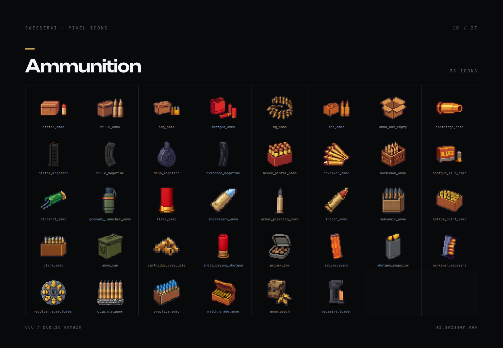

`pistol_ammo` · `rifle_ammo` · `smg_ammo` · `shotgun_ammo` · `mg_ammo` · `snp_ammo` · `ammo_box_empty` · `cartridge_case` · `pistol_magazine` · `rifle_magazine` · `drum_magazine` · `extended_magazine` · `heavy_pistol_ammo` · `revolver_ammo` · `marksman_ammo` · `shotgun_slug_ammo` · `birdshot_ammo` · `grenade_launcher_ammo` · `flare_ammo` · `incendiary_ammo` · `armor_piercing_ammo` · `tracer_ammo` · `subsonic_ammo` · `hollow_point_ammo` · `blank_ammo` · `ammo_can` · `cartridge_case_pile` · `shell_casing_shotgun` · `primer_box` · `smg_magazine` · `shotgun_magazine` · `marksman_magazine` · `revolver_speedloader` · `clip_stripper` · `practice_ammo` · `match_grade_ammo` · `ammo_pouch` · `magazine_loader`

</details>

<details>
<summary><b>Weapon Parts</b> (32 icons)</summary>

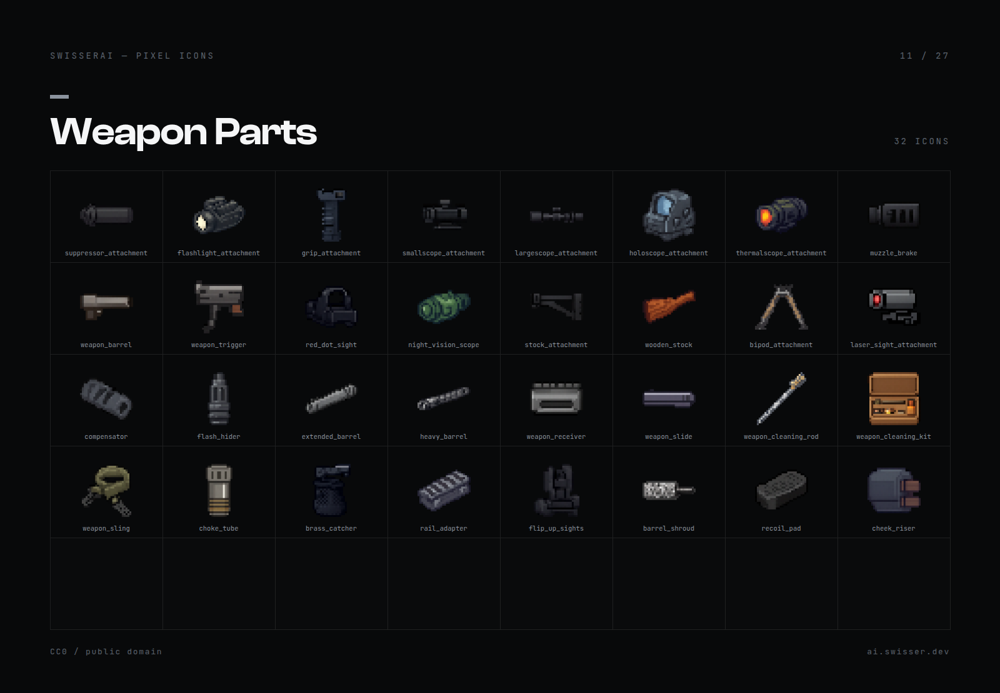

`suppressor_attachment` · `flashlight_attachment` · `grip_attachment` · `smallscope_attachment` · `largescope_attachment` · `holoscope_attachment` · `thermalscope_attachment` · `muzzle_brake` · `weapon_barrel` · `weapon_trigger` · `red_dot_sight` · `night_vision_scope` · `stock_attachment` · `wooden_stock` · `bipod_attachment` · `laser_sight_attachment` · `compensator` · `flash_hider` · `extended_barrel` · `heavy_barrel` · `weapon_receiver` · `weapon_slide` · `weapon_cleaning_rod` · `weapon_cleaning_kit` · `weapon_sling` · `choke_tube` · `brass_catcher` · `rail_adapter` · `flip_up_sights` · `barrel_shroud` · `recoil_pad` · `cheek_riser`

</details>

<details>
<summary><b>Police & Evidence</b> (55 icons)</summary>

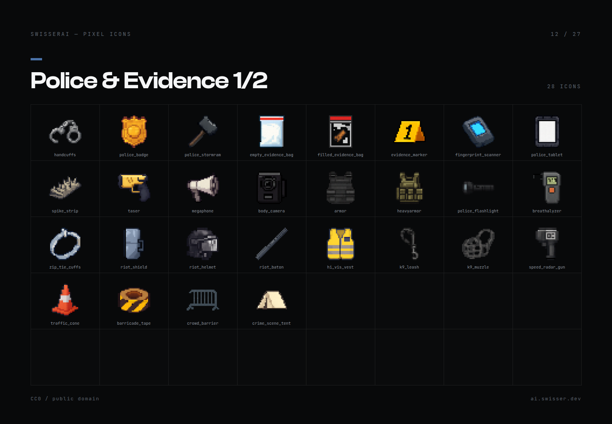

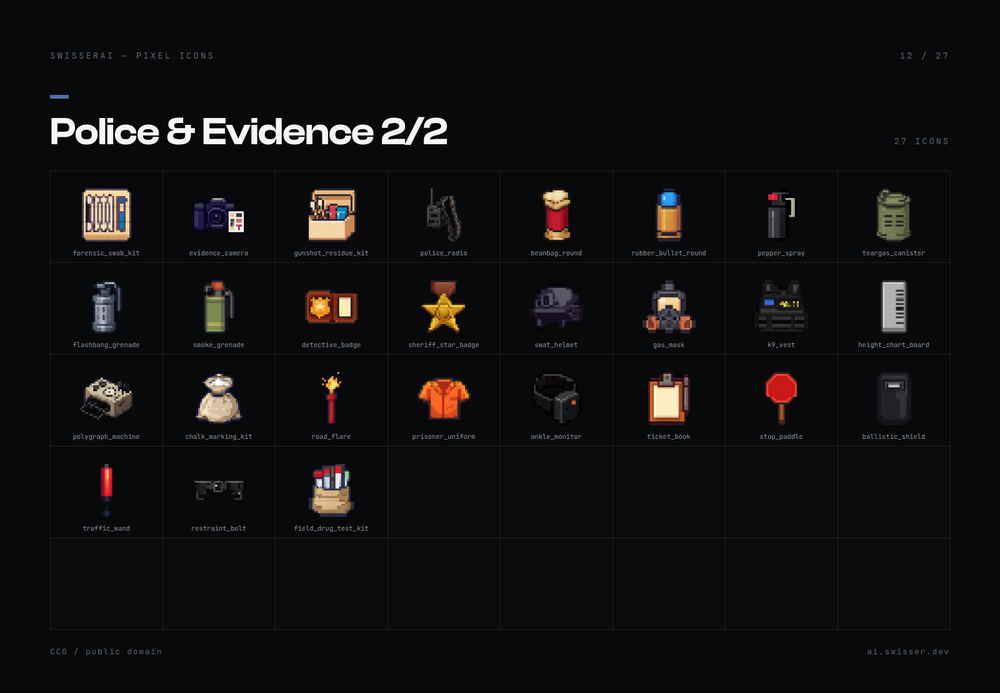

`handcuffs` · `police_badge` · `police_stormram` · `empty_evidence_bag` · `filled_evidence_bag` · `evidence_marker` · `fingerprint_scanner` · `police_tablet` · `spike_strip` · `taser` · `megaphone` · `body_camera` · `armor` · `heavyarmor` · `police_flashlight` · `breathalyzer` · `zip_tie_cuffs` · `riot_shield` · `riot_helmet` · `riot_baton` · `hi_vis_vest` · `k9_leash` · `k9_muzzle` · `speed_radar_gun` · `traffic_cone` · `barricade_tape` · `crowd_barrier` · `crime_scene_tent` · `forensic_swab_kit` · `evidence_camera` · `gunshot_residue_kit` · `police_radio` · `beanbag_round` · `rubber_bullet_round` · `pepper_spray` · `teargas_canister` · `flashbang_grenade` · `smoke_grenade` · `detective_badge` · `sheriff_star_badge` · `swat_helmet` · `gas_mask` · `k9_vest` · `height_chart_board` · `polygraph_machine` · `chalk_marking_kit` · `road_flare` · `prisoner_uniform` · `ankle_monitor` · `ticket_book` · `stop_paddle` · `ballistic_shield` · `traffic_wand` · `restraint_belt` · `field_drug_test_kit`

</details>

<details>
<summary><b>EMS</b> (44 icons)</summary>

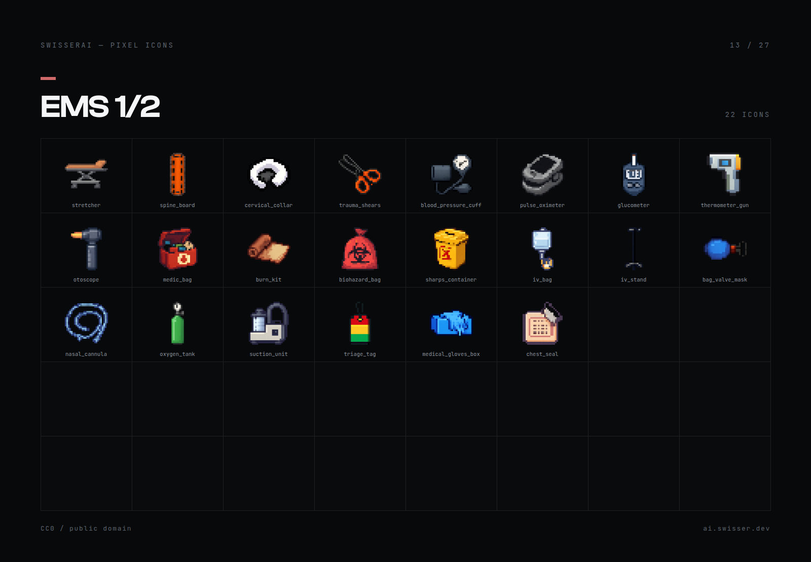

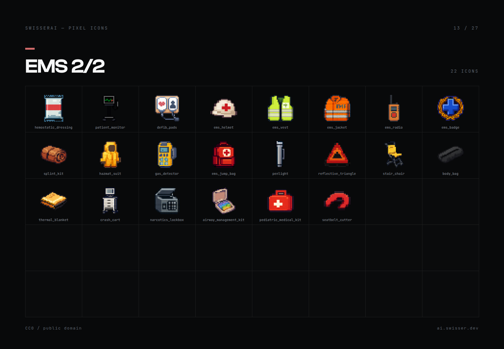

`stretcher` · `spine_board` · `cervical_collar` · `trauma_shears` · `blood_pressure_cuff` · `pulse_oximeter` · `glucometer` · `thermometer_gun` · `otoscope` · `medic_bag` · `burn_kit` · `biohazard_bag` · `sharps_container` · `iv_bag` · `iv_stand` · `bag_valve_mask` · `nasal_cannula` · `oxygen_tank` · `suction_unit` · `triage_tag` · `medical_gloves_box` · `chest_seal` · `hemostatic_dressing` · `patient_monitor` · `defib_pads` · `ems_helmet` · `ems_vest` · `ems_jacket` · `ems_radio` · `ems_badge` · `splint_kit` · `hazmat_suit` · `gas_detector` · `ems_jump_bag` · `penlight` · `reflective_triangle` · `stair_chair` · `body_bag` · `thermal_blanket` · `crash_cart` · `narcotics_lockbox` · `airway_management_kit` · `pediatric_medical_kit` · `seatbelt_cutter`

</details>

<details>
<summary><b>Electronics</b> (59 icons)</summary>

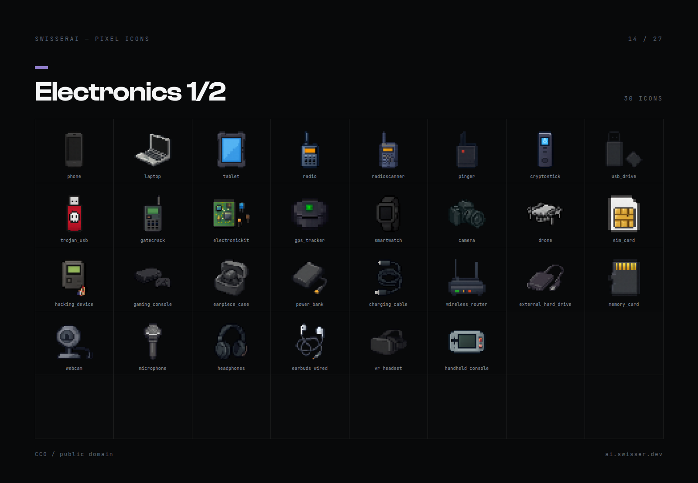

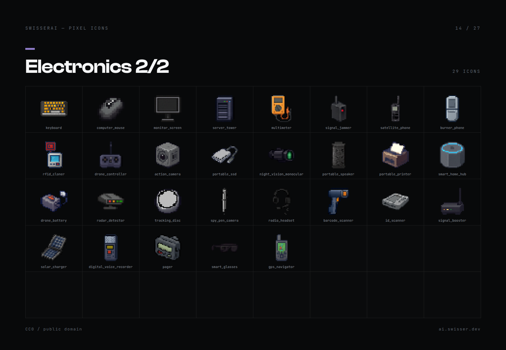

`phone` · `laptop` · `tablet` · `radio` · `radioscanner` · `pinger` · `cryptostick` · `usb_drive` · `trojan_usb` · `gatecrack` · `electronickit` · `gps_tracker` · `smartwatch` · `camera` · `drone` · `sim_card` · `hacking_device` · `gaming_console` · `earpiece_case` · `power_bank` · `charging_cable` · `wireless_router` · `external_hard_drive` · `memory_card` · `webcam` · `microphone` · `headphones` · `earbuds_wired` · `vr_headset` · `handheld_console` · `keyboard` · `computer_mouse` · `monitor_screen` · `server_tower` · `multimeter` · `signal_jammer` · `satellite_phone` · `burner_phone` · `rfid_cloner` · `drone_controller` · `action_camera` · `portable_ssd` · `night_vision_monocular` · `portable_speaker` · `portable_printer` · `smart_home_hub` · `drone_battery` · `radar_detector` · `tracking_disc` · `spy_pen_camera` · `radio_headset` · `barcode_scanner` · `id_scanner` · `signal_booster` · `solar_charger` · `digital_voice_recorder` · `pager` · `smart_glasses` · `gps_navigator`

</details>

<details>
<summary><b>Documents</b> (40 icons)</summary>

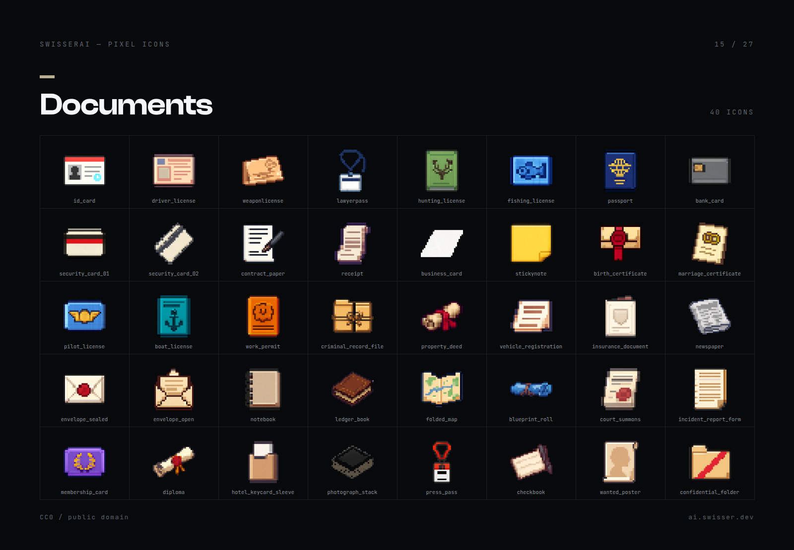

`id_card` · `driver_license` · `weaponlicense` · `lawyerpass` · `hunting_license` · `fishing_license` · `passport` · `bank_card` · `security_card_01` · `security_card_02` · `contract_paper` · `receipt` · `business_card` · `stickynote` · `birth_certificate` · `marriage_certificate` · `pilot_license` · `boat_license` · `work_permit` · `criminal_record_file` · `property_deed` · `vehicle_registration` · `insurance_document` · `newspaper` · `envelope_sealed` · `envelope_open` · `notebook` · `ledger_book` · `folded_map` · `blueprint_roll` · `court_summons` · `incident_report_form` · `membership_card` · `diploma` · `hotel_keycard_sleeve` · `photograph_stack` · `press_pass` · `checkbook` · `wanted_poster` · `confidential_folder`

</details>

<details>
<summary><b>Keys</b> (25 icons)</summary>

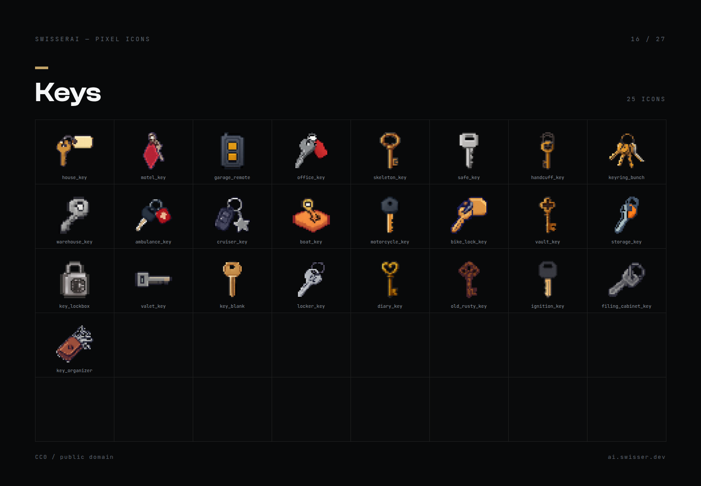

`house_key` · `motel_key` · `garage_remote` · `office_key` · `skeleton_key` · `safe_key` · `handcuff_key` · `keyring_bunch` · `warehouse_key` · `ambulance_key` · `cruiser_key` · `boat_key` · `motorcycle_key` · `bike_lock_key` · `vault_key` · `storage_key` · `key_lockbox` · `valet_key` · `key_blank` · `locker_key` · `diary_key` · `old_rusty_key` · `ignition_key` · `filing_cabinet_key` · `key_organizer`

</details>

<details>
<summary><b>Bags</b> (25 icons)</summary>

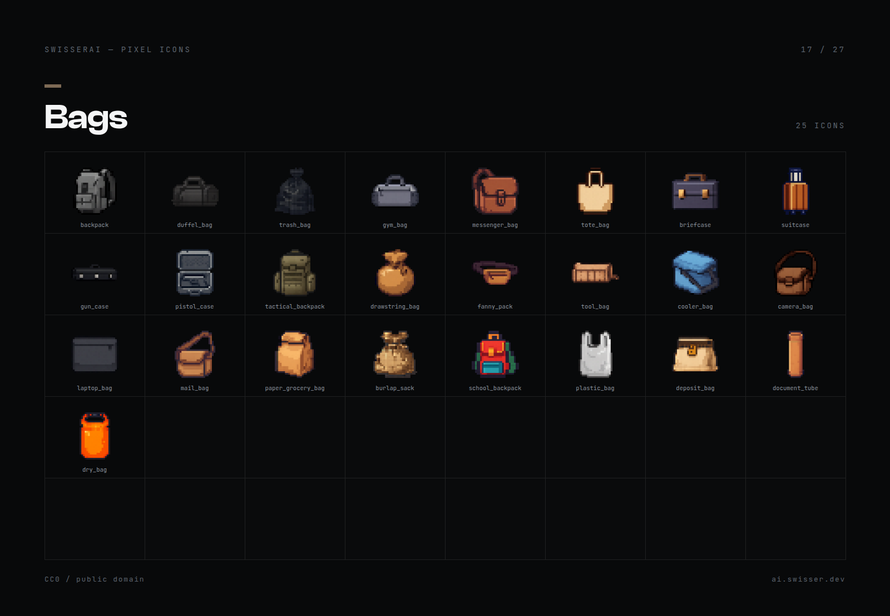

`backpack` · `duffel_bag` · `trash_bag` · `gym_bag` · `messenger_bag` · `tote_bag` · `briefcase` · `suitcase` · `gun_case` · `pistol_case` · `tactical_backpack` · `drawstring_bag` · `fanny_pack` · `tool_bag` · `cooler_bag` · `camera_bag` · `laptop_bag` · `mail_bag` · `paper_grocery_bag` · `burlap_sack` · `school_backpack` · `plastic_bag` · `deposit_bag` · `document_tube` · `dry_bag`

</details>

<details>
<summary><b>Security</b> (25 icons)</summary>

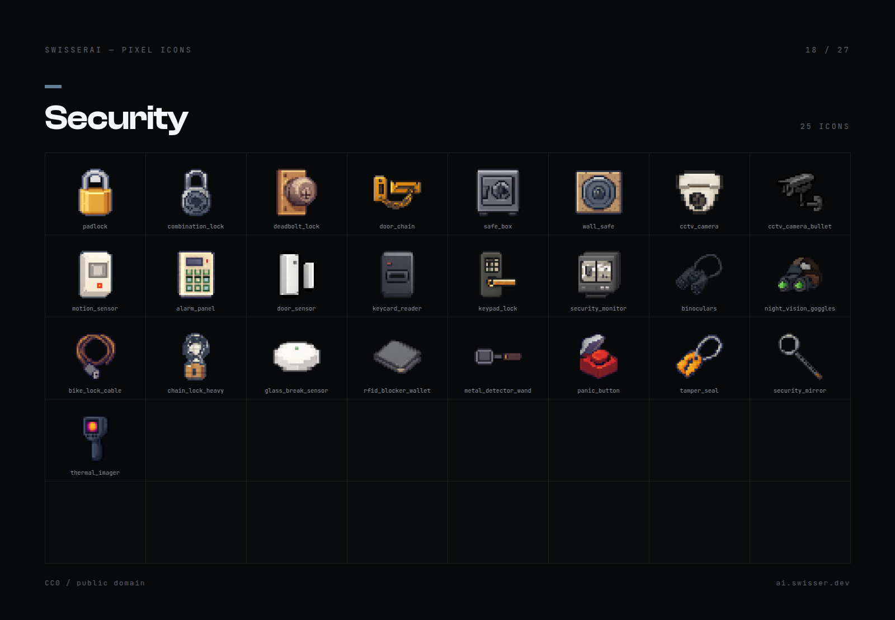

`padlock` · `combination_lock` · `deadbolt_lock` · `door_chain` · `safe_box` · `wall_safe` · `cctv_camera` · `cctv_camera_bullet` · `motion_sensor` · `alarm_panel` · `door_sensor` · `keycard_reader` · `keypad_lock` · `security_monitor` · `binoculars` · `night_vision_goggles` · `bike_lock_cable` · `chain_lock_heavy` · `glass_break_sensor` · `rfid_blocker_wallet` · `metal_detector_wand` · `panic_button` · `tamper_seal` · `security_mirror` · `thermal_imager`

</details>

<details>
<summary><b>Materials</b> (39 icons)</summary>

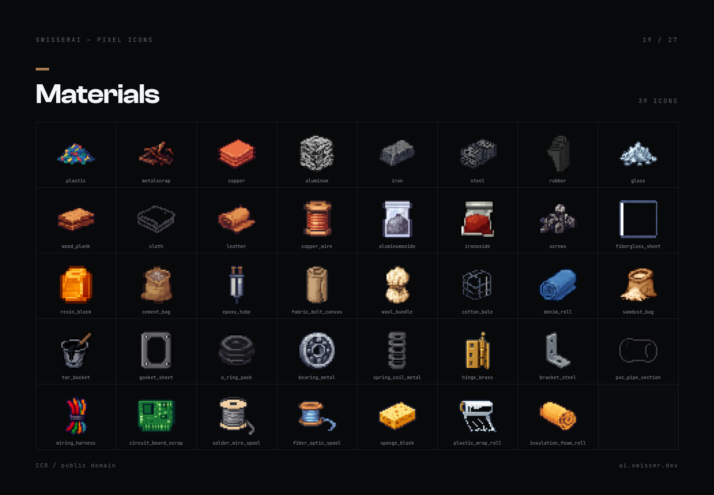

`plastic` · `metalscrap` · `copper` · `aluminum` · `iron` · `steel` · `rubber` · `glass` · `wood_plank` · `cloth` · `leather` · `copper_wire` · `aluminumoxide` · `ironoxide` · `screws` · `fiberglass_sheet` · `resin_block` · `cement_bag` · `epoxy_tube` · `fabric_bolt_canvas` · `wool_bundle` · `cotton_bale` · `denim_roll` · `sawdust_bag` · `tar_bucket` · `gasket_sheet` · `o_ring_pack` · `bearing_metal` · `spring_coil_metal` · `hinge_brass` · `bracket_steel` · `pvc_pipe_section` · `wiring_harness` · `circuit_board_scrap` · `solder_wire_spool` · `fiber_optic_spool` · `sponge_block` · `plastic_wrap_roll` · `insulation_foam_roll`

</details>

<details>
<summary><b>Crafting</b> (34 icons)</summary>

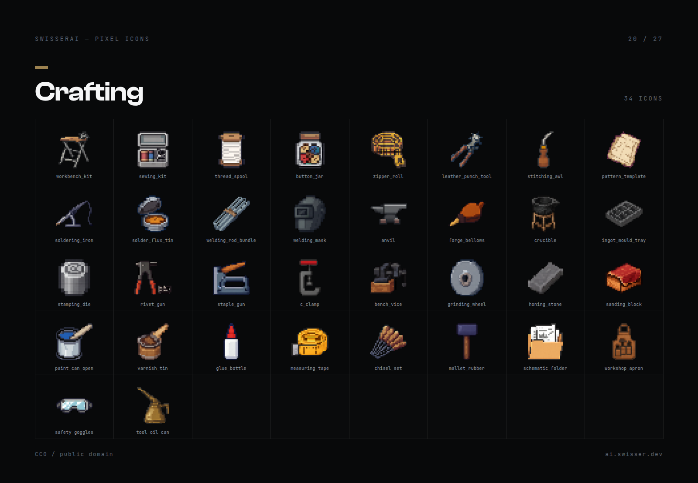

`workbench_kit` · `sewing_kit` · `thread_spool` · `button_jar` · `zipper_roll` · `leather_punch_tool` · `stitching_awl` · `pattern_template` · `soldering_iron` · `solder_flux_tin` · `welding_rod_bundle` · `welding_mask` · `anvil` · `forge_bellows` · `crucible` · `ingot_mould_tray` · `stamping_die` · `rivet_gun` · `staple_gun` · `c_clamp` · `bench_vice` · `grinding_wheel` · `honing_stone` · `sanding_block` · `paint_can_open` · `varnish_tin` · `glue_bottle` · `measuring_tape` · `chisel_set` · `mallet_rubber` · `schematic_folder` · `workshop_apron` · `safety_goggles` · `tool_oil_can`

</details>

<details>
<summary><b>Vehicle Parts</b> (45 icons)</summary>

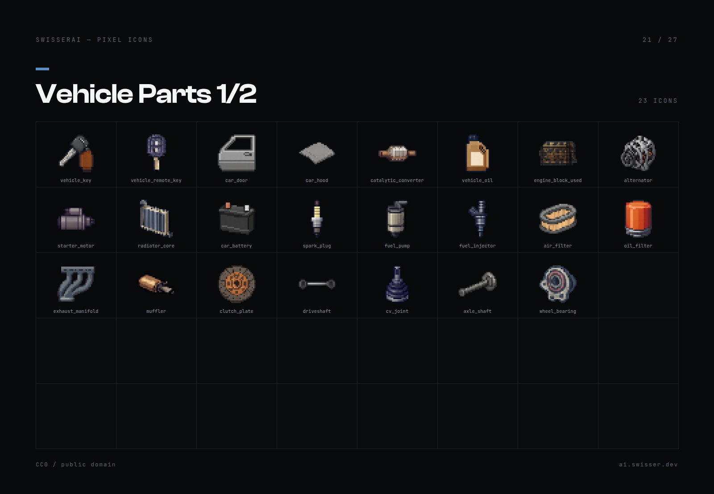

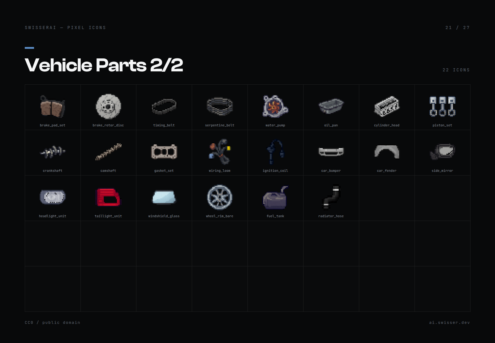

`vehicle_key` · `vehicle_remote_key` · `car_door` · `car_hood` · `catalytic_converter` · `vehicle_oil` · `engine_block_used` · `alternator` · `starter_motor` · `radiator_core` · `car_battery` · `spark_plug` · `fuel_pump` · `fuel_injector` · `air_filter` · `oil_filter` · `exhaust_manifold` · `muffler` · `clutch_plate` · `driveshaft` · `cv_joint` · `axle_shaft` · `wheel_bearing` · `brake_pad_set` · `brake_rotor_disc` · `timing_belt` · `serpentine_belt` · `water_pump` · `oil_pan` · `cylinder_head` · `piston_set` · `crankshaft` · `camshaft` · `gasket_set` · `wiring_loom` · `ignition_coil` · `car_bumper` · `car_fender` · `side_mirror` · `headlight_unit` · `taillight_unit` · `windshield_glass` · `wheel_rim_bare` · `fuel_tank` · `radiator_hose`

</details>

<details>
<summary><b>Vehicle Tuning</b> (40 icons)</summary>

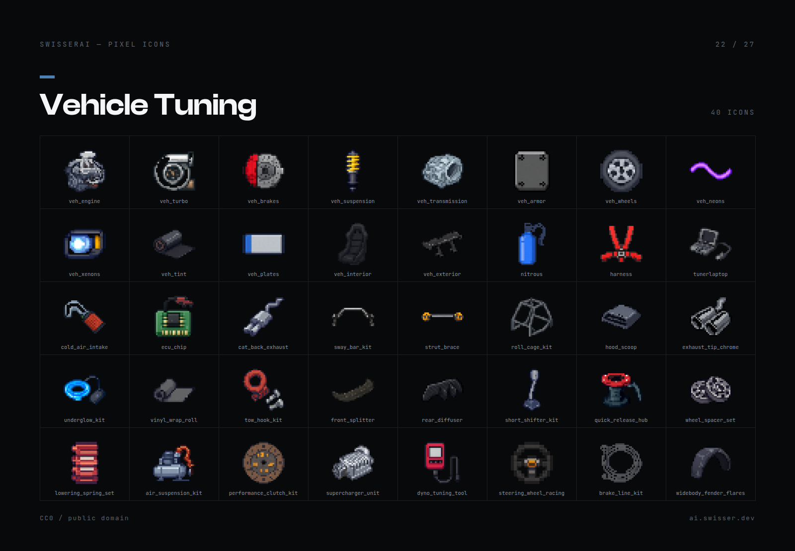

`veh_engine` · `veh_turbo` · `veh_brakes` · `veh_suspension` · `veh_transmission` · `veh_armor` · `veh_wheels` · `veh_neons` · `veh_xenons` · `veh_tint` · `veh_plates` · `veh_interior` · `veh_exterior` · `nitrous` · `harness` · `tunerlaptop` · `cold_air_intake` · `ecu_chip` · `cat_back_exhaust` · `sway_bar_kit` · `strut_brace` · `roll_cage_kit` · `hood_scoop` · `exhaust_tip_chrome` · `underglow_kit` · `vinyl_wrap_roll` · `tow_hook_kit` · `front_splitter` · `rear_diffuser` · `short_shifter_kit` · `quick_release_hub` · `wheel_spacer_set` · `lowering_spring_set` · `air_suspension_kit` · `performance_clutch_kit` · `supercharger_unit` · `dyno_tuning_tool` · `steering_wheel_racing` · `brake_line_kit` · `widebody_fender_flares`

</details>

<details>
<summary><b>Mining</b> (68 icons)</summary>

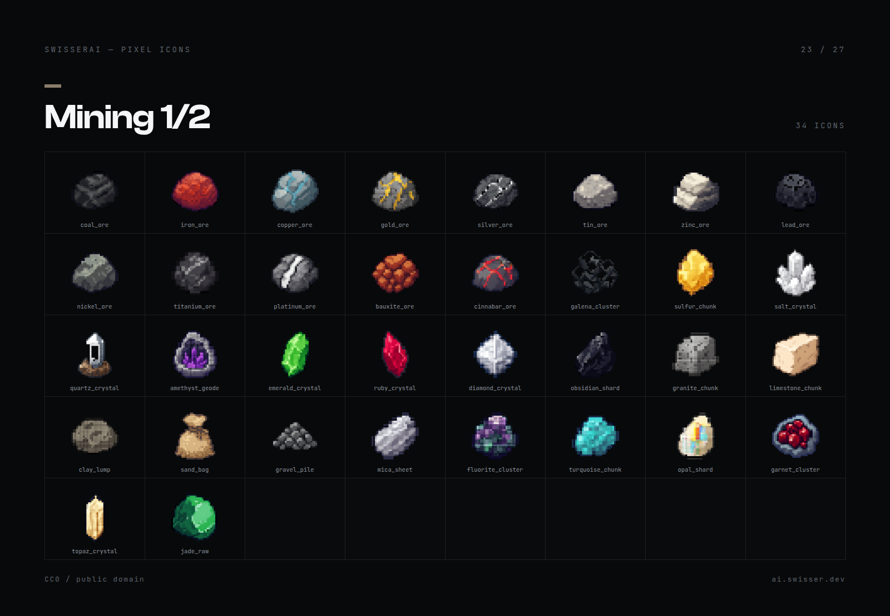

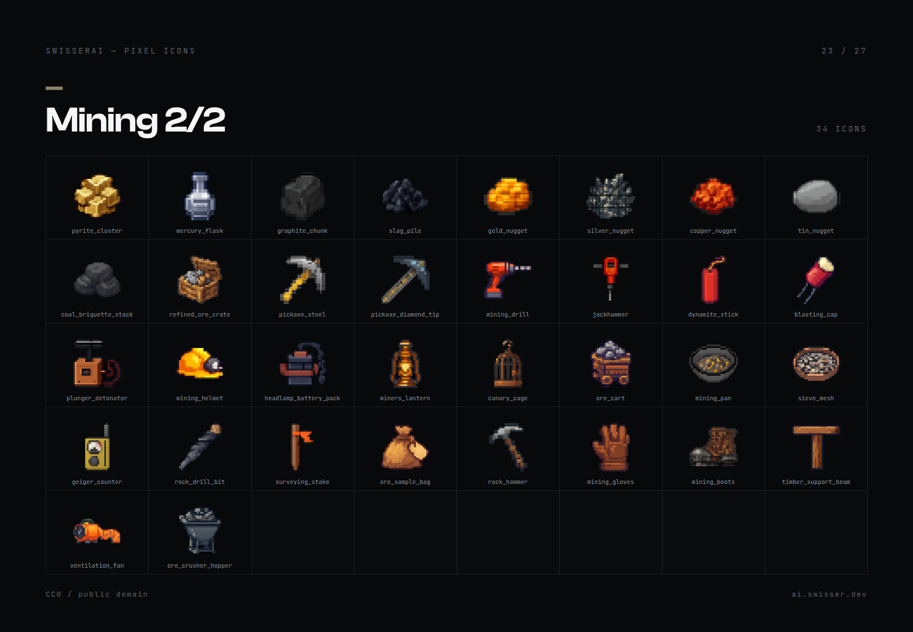

`coal_ore` · `iron_ore` · `copper_ore` · `gold_ore` · `silver_ore` · `tin_ore` · `zinc_ore` · `lead_ore` · `nickel_ore` · `titanium_ore` · `platinum_ore` · `bauxite_ore` · `cinnabar_ore` · `galena_cluster` · `sulfur_chunk` · `salt_crystal` · `quartz_crystal` · `amethyst_geode` · `emerald_crystal` · `ruby_crystal` · `diamond_crystal` · `obsidian_shard` · `granite_chunk` · `limestone_chunk` · `clay_lump` · `sand_bag` · `gravel_pile` · `mica_sheet` · `fluorite_cluster` · `turquoise_chunk` · `opal_shard` · `garnet_cluster` · `topaz_crystal` · `jade_raw` · `pyrite_cluster` · `mercury_flask` · `graphite_chunk` · `slag_pile` · `gold_nugget` · `silver_nugget` · `copper_nugget` · `tin_nugget` · `coal_briquette_stack` · `refined_ore_crate` · `pickaxe_steel` · `pickaxe_diamond_tip` · `mining_drill` · `jackhammer` · `dynamite_stick` · `blasting_cap` · `plunger_detonator` · `mining_helmet` · `headlamp_battery_pack` · `miners_lantern` · `canary_cage` · `ore_cart` · `mining_pan` · `sieve_mesh` · `geiger_counter` · `rock_drill_bit` · `surveying_stake` · `ore_sample_bag` · `rock_hammer` · `mining_gloves` · `mining_boots` · `timber_support_beam` · `ventilation_fan` · `ore_crusher_hopper`

</details>

<details>
<summary><b>Fishing</b> (75 icons)</summary>

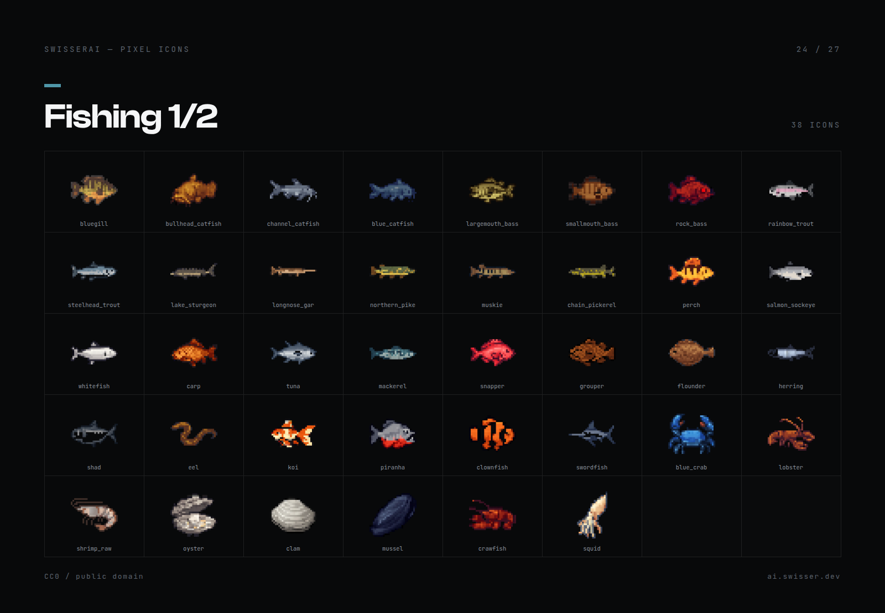

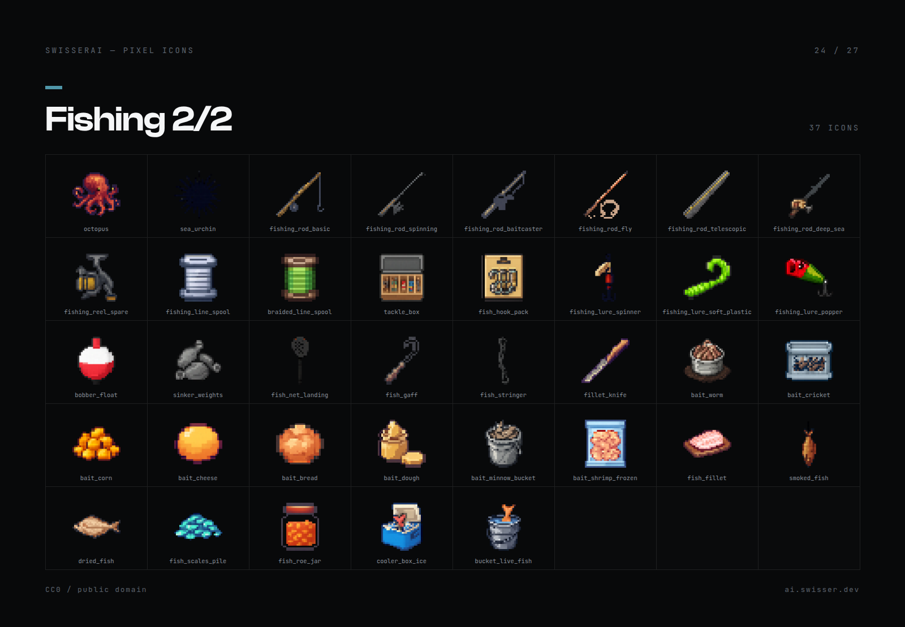

`bluegill` · `bullhead_catfish` · `channel_catfish` · `blue_catfish` · `largemouth_bass` · `smallmouth_bass` · `rock_bass` · `rainbow_trout` · `steelhead_trout` · `lake_sturgeon` · `longnose_gar` · `northern_pike` · `muskie` · `chain_pickerel` · `perch` · `salmon_sockeye` · `whitefish` · `carp` · `tuna` · `mackerel` · `snapper` · `grouper` · `flounder` · `herring` · `shad` · `eel` · `koi` · `piranha` · `clownfish` · `swordfish` · `blue_crab` · `lobster` · `shrimp_raw` · `oyster` · `clam` · `mussel` · `crawfish` · `squid` · `octopus` · `sea_urchin` · `fishing_rod_basic` · `fishing_rod_spinning` · `fishing_rod_baitcaster` · `fishing_rod_fly` · `fishing_rod_telescopic` · `fishing_rod_deep_sea` · `fishing_reel_spare` · `fishing_line_spool` · `braided_line_spool` · `tackle_box` · `fish_hook_pack` · `fishing_lure_spinner` · `fishing_lure_soft_plastic` · `fishing_lure_popper` · `bobber_float` · `sinker_weights` · `fish_net_landing` · `fish_gaff` · `fish_stringer` · `fillet_knife` · `bait_worm` · `bait_cricket` · `bait_corn` · `bait_cheese` · `bait_bread` · `bait_dough` · `bait_minnow_bucket` · `bait_shrimp_frozen` · `fish_fillet` · `smoked_fish` · `dried_fish` · `fish_scales_pile` · `fish_roe_jar` · `cooler_box_ice` · `bucket_live_fish`

</details>

<details>
<summary><b>Hunting</b> (75 icons)</summary>

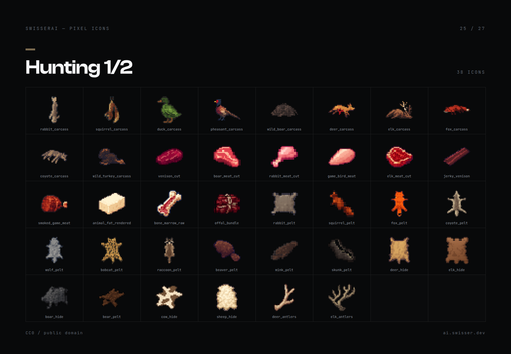

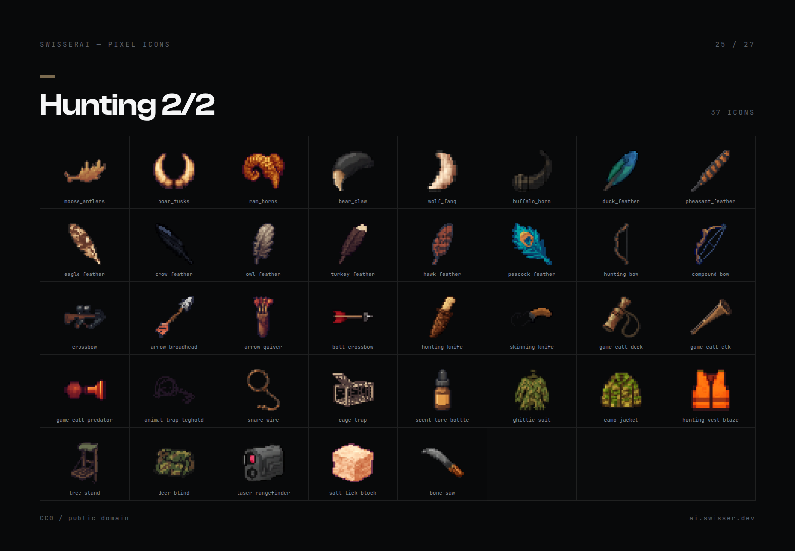

`rabbit_carcass` · `squirrel_carcass` · `duck_carcass` · `pheasant_carcass` · `wild_boar_carcass` · `deer_carcass` · `elk_carcass` · `fox_carcass` · `coyote_carcass` · `wild_turkey_carcass` · `venison_cut` · `boar_meat_cut` · `rabbit_meat_cut` · `game_bird_meat` · `elk_meat_cut` · `jerky_venison` · `smoked_game_meat` · `animal_fat_rendered` · `bone_marrow_raw` · `offal_bundle` · `rabbit_pelt` · `squirrel_pelt` · `fox_pelt` · `coyote_pelt` · `wolf_pelt` · `bobcat_pelt` · `raccoon_pelt` · `beaver_pelt` · `mink_pelt` · `skunk_pelt` · `deer_hide` · `elk_hide` · `boar_hide` · `bear_pelt` · `cow_hide` · `sheep_hide` · `deer_antlers` · `elk_antlers` · `moose_antlers` · `boar_tusks` · `ram_horns` · `bear_claw` · `wolf_fang` · `buffalo_horn` · `duck_feather` · `pheasant_feather` · `eagle_feather` · `crow_feather` · `owl_feather` · `turkey_feather` · `hawk_feather` · `peacock_feather` · `hunting_bow` · `compound_bow` · `crossbow` · `arrow_broadhead` · `arrow_quiver` · `bolt_crossbow` · `hunting_knife` · `skinning_knife` · `game_call_duck` · `game_call_elk` · `game_call_predator` · `animal_trap_leghold` · `snare_wire` · `cage_trap` · `scent_lure_bottle` · `ghillie_suit` · `camo_jacket` · `hunting_vest_blaze` · `tree_stand` · `deer_blind` · `laser_rangefinder` · `salt_lick_block` · `bone_saw`

</details>

<details>
<summary><b>Valuables</b> (31 icons)</summary>

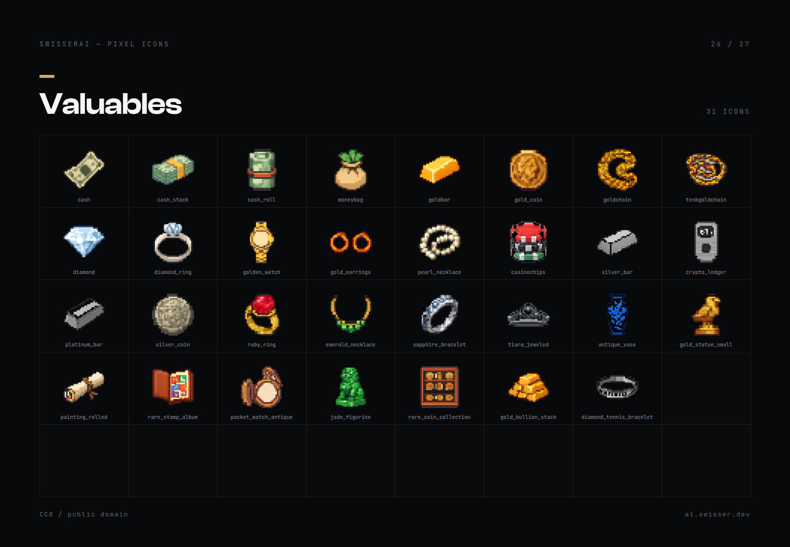

`cash` · `cash_stack` · `cash_roll` · `moneybag` · `goldbar` · `gold_coin` · `goldchain` · `tenkgoldchain` · `diamond` · `diamond_ring` · `golden_watch` · `gold_earrings` · `pearl_necklace` · `casinochips` · `silver_bar` · `crypto_ledger` · `platinum_bar` · `silver_coin` · `ruby_ring` · `emerald_necklace` · `sapphire_bracelet` · `tiara_jeweled` · `antique_vase` · `gold_statue_small` · `painting_rolled` · `rare_stamp_album` · `pocket_watch_antique` · `jade_figurine` · `rare_coin_collection` · `gold_bullion_stack` · `diamond_tennis_bracelet`

</details>

<details>
<summary><b>Misc</b> (21 icons)</summary>

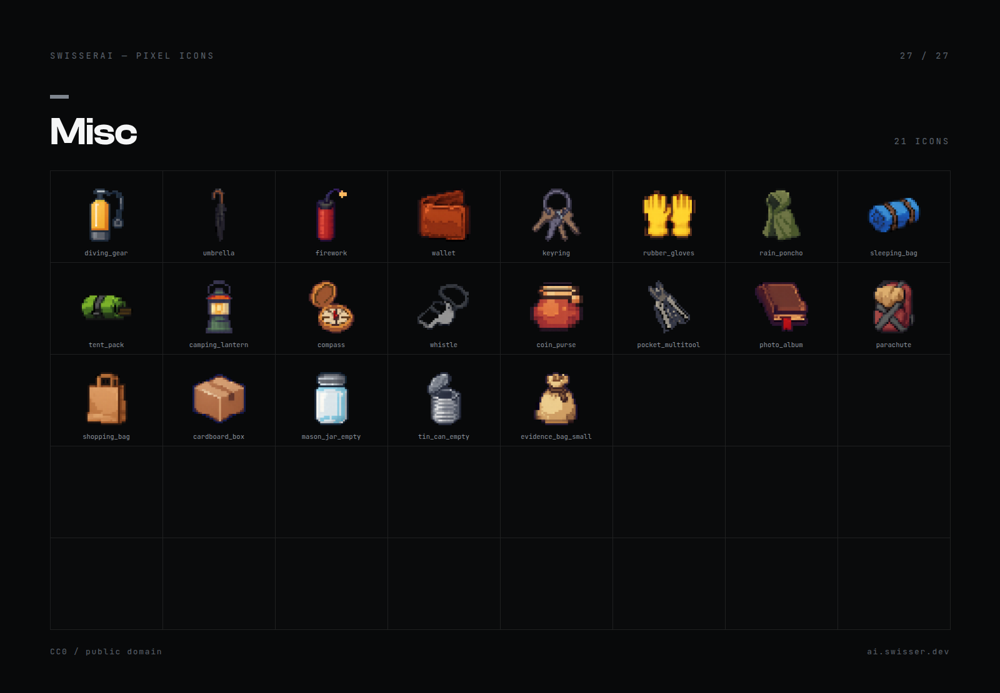

`diving_gear` · `umbrella` · `firework` · `wallet` · `keyring` · `rubber_gloves` · `rain_poncho` · `sleeping_bag` · `tent_pack` · `camping_lantern` · `compass` · `whistle` · `coin_purse` · `pocket_multitool` · `photo_album` · `parachute` · `shopping_bag` · `cardboard_box` · `mason_jar_empty` · `tin_can_empty` · `evidence_bag_small`

</details>

## Other styles

Same catalogue, different look. Pick the one that matches your inventory UI:

- [Photoreal 3D](https://github.com/SwisserDev/fivem-icons-photoreal)
- [Drawn Artwork](https://github.com/SwisserDev/fivem-icons-artwork)
- [Outlined Flat](https://github.com/SwisserDev/fivem-icons-outline)
- [Flat Minimal](https://github.com/SwisserDev/fivem-icons-minimal)
- [Monochrome](https://github.com/SwisserDev/fivem-icons-monochrome)
- [Pixel Art](https://github.com/SwisserDev/fivem-icons-pixel) — you are here
- [Neon Cyberpunk](https://github.com/SwisserDev/fivem-icons-neon)
- [Retro Print](https://github.com/SwisserDev/fivem-icons-retro)

## Notes

The icons are AI generated, then run through a fixed normalisation pass: tight
alpha crop ignoring the drop shadow, uniform fill ratio, centred on a square
canvas. That is why they sit the same way in a slot instead of jumping around in
size.

No real-world trademarks are depicted. Where an item would normally reference a
brand, it uses a generic or GTA-lore equivalent.

## License

[CC0 1.0 Universal](LICENSE), public domain. Use them, change them, ship them on
a paid server, redistribute them. No attribution needed.

---

Made with [SwisserAI](https://ai.swisser.dev), AI asset tools for FiveM.
